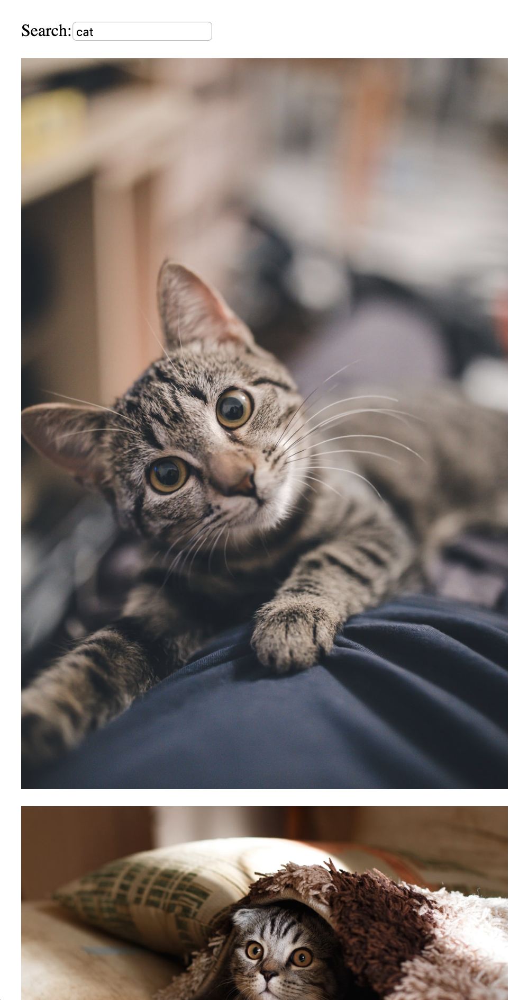

# Unsplash Web Hiring Test

## Development

```
yarn
npm run compile:watch
npm run start:server
```

The server can be opened at `http://127.0.0.1:8080/`

Tests can be run with:

```
yarn
npm run test
```

## Instructions

- Don't spend more than 3 hours on this test.
- Attempt as many sections as possible: if you get stuck on one of them, move on and get back to it later if you still have time.
- Add your CSS inside of `src/index.html`; there is no need for a separate CSS file of any kind.
- Write your TS code wherever you prefer inside of `src/`.
- We have provided a Redux store for the API call response, but feel free to use any other storage library/mechanism that you find more convenient instead (MobX, React hooks, etc).
- We expect you NOT to use a design/UI library for your components: we want you to code them manually.

## Challenge

This code contains a React app with a search form that performs an API call when the input changes. We want you to add the following functionality to it:

- [ ] When a request is successful, display a photo feed with the following specifications:

  - [ ] desktop
    - [ ] 3 photos per row
    - [ ] 12px horizontal gap between photos, 8px vertical gap between rows
  - [ ] mobile
    - [ ] single-column list
    - [ ] 12px vertical gap between photos
    - [ ] All photos should maintain their original aspect ratio

  For convenience, we wrote a `Photo` component that you can use as a starting point. Here are a few screenshots to give a basic idea of what we're looking for:

  
  

- [ ] You are now handling the success state. What are the other possible states of your app? For each one, display a simple UI instead of the photo feed to inform the user of the current state. A text message will suffice.

- [ ] Add a "Like" button centered on top of each photo:

  - [ ] It should only be shown when the user hovers over the photo.
  - [ ] When clicked, the photo becomes overlayed with a green color. Clicking the button again removes the green overlay.

- [ ] Add a "Clear" button that clears the `input`. It should be displayed as follows:

  - [ ] desktop: on the same row as the `input`
  - [ ] mobile: below the `input`
